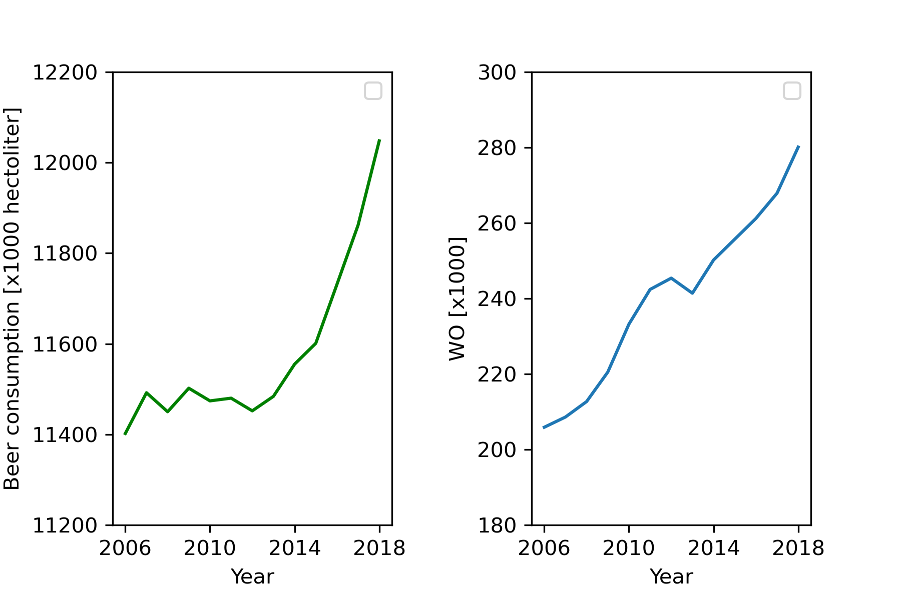

## Author
Charlotte Frenzen

## Paper titles
- Fantastic yeasts and where to find them: the hidden diversity of dimorphic fungal pathogens OR The Rise of Coccidioides: Forces Against the Dust Devil Unleashed
- An analysis of the forces required to drag sheep over various surfaces
- Correlation of continuous cardiac output measured by a pulmonary artery catheter versus impedance cardiography in
ventilated patients

## Dataset visualisation

